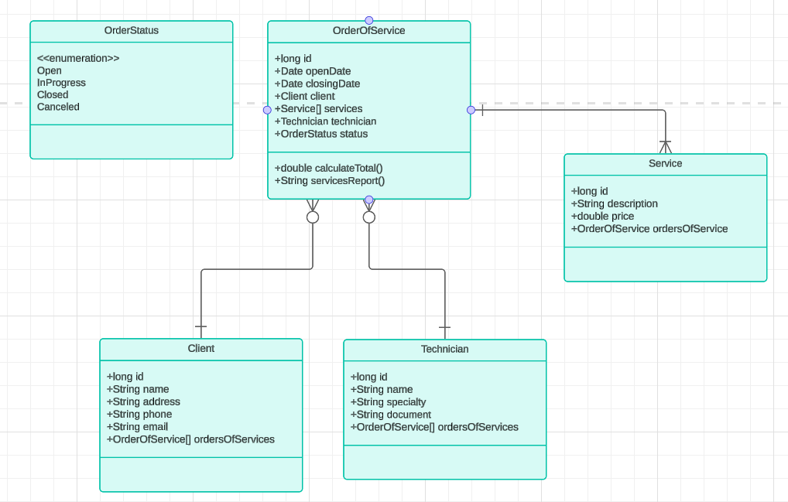

# Order of Service App

## Objetivo
O projeto visa desenvolver um sistema de ordem de serviços para facilitar o gerenciamento e acompanhamento das demandas de serviço. A implementação desse sistema proporcionará maior organização, eficiência e controle sobre todas as etapas dos serviços prestados.

## Funcionalidades Principais
- Cadastro de Clientes
- Cadastro de Serviços
- Cadastro de Técnicos
- Registro de Ordens de Serviço
- Atribuição de Tarefas
- Registro de Atividades
- Geração de Relatórios

## Tecnologias Utilizadas
- Java
- Spring Boot
- Hibernate
- Banco de dados relacional: PostgreSQL

## Modelagem de Dados
O sistema utiliza as seguintes entidades principais:
- `Client` (Cliente)
- `Service` (Serviço)
- `Technician` (Técnico)
- `OrderOfService` (Ordem de Serviço)

## Diagrama de Classe

## Considerações Finais
O Sistema de Gestão de Ordens de Serviço representa um importante investimento para a modernização e otimização dos processos. Através da sua implementação, espera-se alcançar uma gestão mais eficiente e transparente, garantindo a satisfação dos clientes e o sucesso dos serviços.

